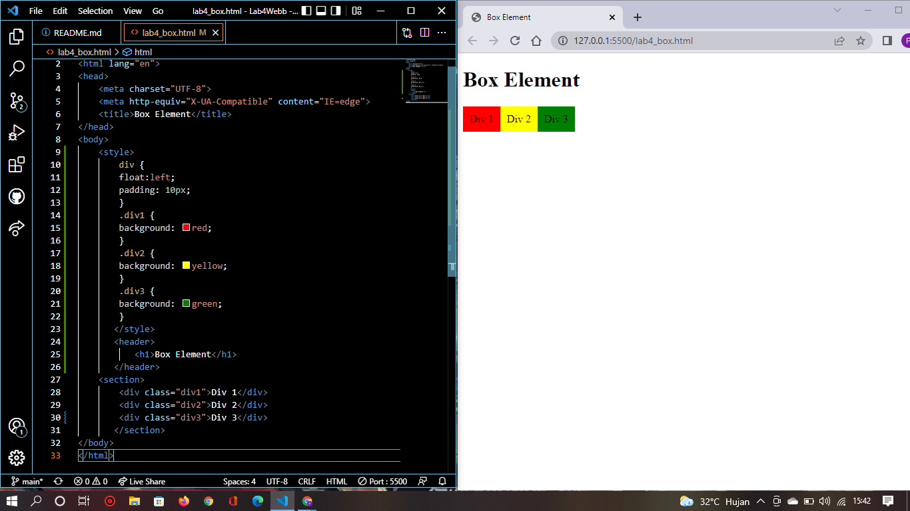
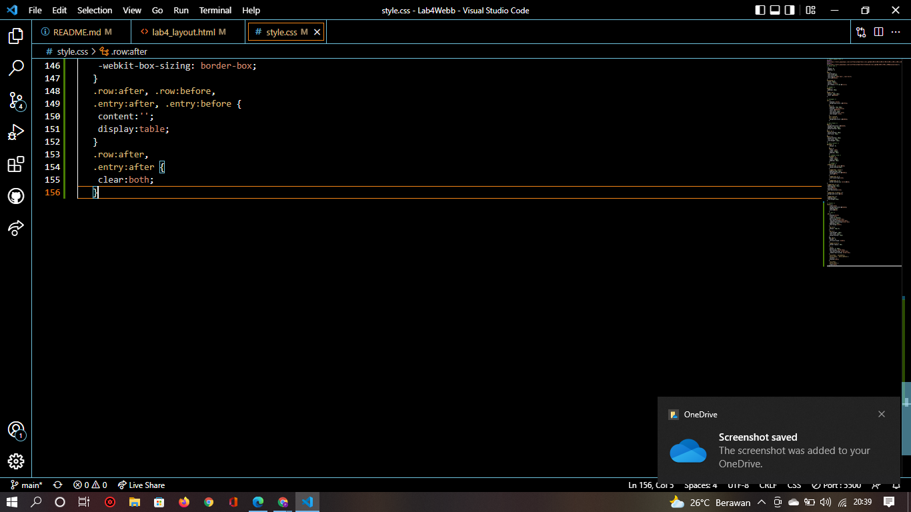

# Lab4Web
## Nama     : Prananda Aditya
## NIM      : 312010130
## Kelas    : TI.20.A1
## Matkul   : Pemograman Web

# Langkah-langkah Praktikum
## Membuat Box
 Pertama membuat dokumen HTML dengan nama file lab4_box.html seperti berikut.

## membuat Box Element
 Kemudian tambahkan kode untuk membuat box element dengan tag div seperti berikut.

## CSS Float Property
 Selanjutnya tambahkan deklarasi CSS pada head untuk membuat float element, seperti berikut.dan buka browser untuk melihat hasilnya

## Mengatur Clearfix Element
 Clearfix digunakan untuk mengatur element setelah float element. Property clear digunakan untuk mengaturnya. Tambahkan element div lainnya seteleah div3 seperti berikut.

 Kemudian atur property clear pada CSS seperti berikut, kemudian simpan dan lihat hasilnya pada web browser. 

## Membuat Layout Sederhana
 Kita akan membuat layout web sederhana seperti gambar berikut.

 Buat folder baru dengan nama lab4_layout, kemudian buatlah file baru didalamnya dengan nama home.html, dan file css dengan nama style.css.

 Kemudian buat kerangka layout dengan semantics element seperti berikut.

 Kemudian tulis kode berikut dan liat hasilnya.

 Kemudian tambah kode CSS untuk membuat layout, dan hasilnya akan seperti berikut.

## Membuat Navigasi
 Selanjutnya untuk mengatur navigasi dengan kode berikut, kemudian lihat hasilnya.

## Membuat Hero Panel
 Selanjutnya membuat heropanel. Tambahkankode HTML dan CSS seperti berikut.

 kemudian hasilnya akan seperti berikut:

## Mangatur Layout Main & Sidebar
 Selanjutnya mengatur main content dan sidebar, tambahkan CSS float.

## Membuat Sidebar Widget
 kemudian tambahkan elemen lain dalam sidebar, dan juga tambahkan CSS.

 Maka hasilnya akan seperti berikut :

## Mengatur Footer
 selanjutnya mengatur footer dengan menambahkan CSS untuk footer.

## Menambahkan Elemen Lainnya Pada Main Content

 Maka Hasilnya akan seperti berikut.

## Menambahkan Content Artikel
 Selanjutnya membuat content artikel. Tambahkan HTML berikut pada main content.

 Dan ini hasilnya.

# Pertanyaan & Tugas
 1. Tambahkan layout untuk membuat abut
Buat single layout yang berisi deskripsi,portofolio, dll.
 2. Tambahkan layout untuk contact
Yang berisi form isian : nama, email, message, dll.

# jawaban
 1. Disini saya akan menambahkan About yang berisi deskripsi, portofolio, dll. dengan menambahkan HTLM dan CSS seperti berikut.

 hasilnya seperti berikut.

 2. Saya akan tambahkan layout untuk contact yang berisi nama, email, massage, dll, dengan menambahkan HTML dan CSS seperti berikut.

 hasilnya akan seperti berikut.
