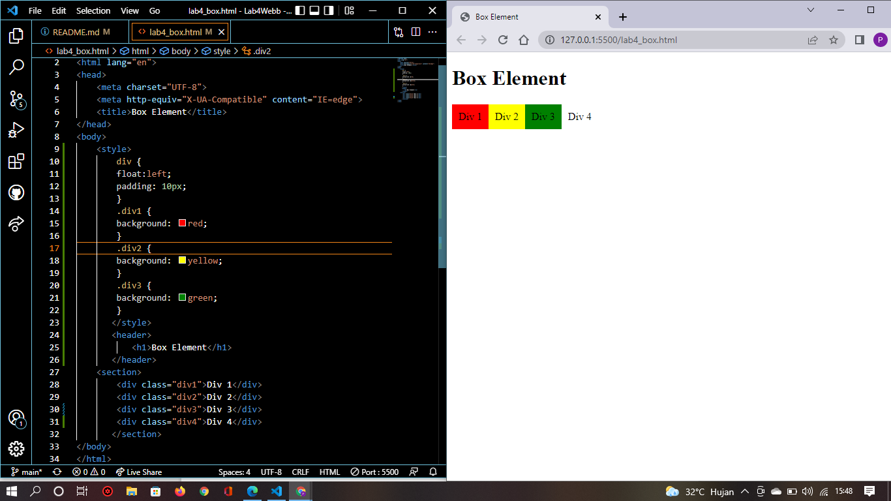

# Lab4Web
## Nama     : Prananda Aditya
## NIM      : 312010130
## Kelas    : TI.20.A1
## Matkul   : Pemograman Web

# Membuat Box
## Langkah-langkah Praktikum
 Pertama membuat dokumen HTML dengan nama file lab4_box.html seperti berikut.

# membuat Box Element
 Kemudian tambahkan kode untuk membuat box element dengan tag div seperti berikut.
# CSS Float Property

 Selanjutnya tambahkan deklarasi CSS pada head untuk membuat float element, seperti berikut.

 buka pada browser untuk melihat hasilnya seperti berikut.
